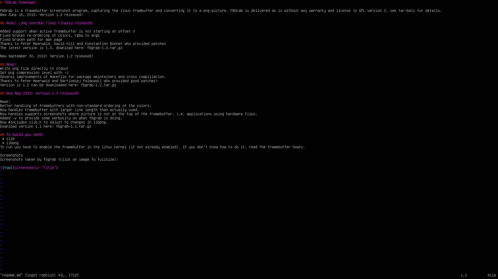

# FBGrab

FBGrab is a framebuffer screenshot program, capturing the linux frambuffer and converting it to a png-picture. FBGrab is delivered as is without any warranty and license is GPL version 2, see tar-ball for details.

## NAME
       fbgrab - takes screenshots using the framebuffer device

## SYNOPSIS
       fbgrab [options] filename

## DESCRIPTION
       fbgrab  reads  the  framebuffer device (/dev/fb*) or a dump thereof and
       saves a PNG image file. You can use it for  making  screenshots  of  of
       virtually  any  application, from traditional test applications to your
       X-windows desktop, as well as framebuffer applications.

## OPTIONS
       -?     print usage information.

       -a     ignore the alpha channel, to support pixel formats like BGR32.

       -b bitdepth
              the number of bits per pixel used, optional  when  reading  from
              device.

       -c console
              specifies which console (or virtual terminal - like other people
              call this feature) to grab. Sometimes this  changing  is  faster
              then  the  framebuffer  is  refreshed  (especially when grabbing
              framebuffer apps). If so, you should use  -C  console  ...  This
              waits some time before grabbing. You can't use -s in this case.

       -d device
              specifies  which  framebuffer device you want to read. If you do
              not use this option, it takes the  value  from  the  FRAMEBUFFER
              environment  variable. If no FRAMEBUFFER environment variable is
              given or if its value is NULL, then DEFAULT_FB  is  taken.  (see
              source code), which usually is /dev/fb0.

       -f filename
              Read from from file instead of device, requires that -w (width),
              -h (height) and -b (bitdepth) are specified.

       -h height
              the height of the frambeuffer in pixels, optional  when  reading
              from device.

       -i     turns off interlacing. If you do not want ADAM7 interlacing, you
              should use the -i option.

       -l line length, a.k.a. stride.
              the length  in  pixels  between  the  start  of  each row in the
              framebuffer, which might be larger or equal  to  width. Optional
              when reading from device.

       -s seconds
              specifies how many seconds to wait before grabbing. fbshot  does
              not  lock console switching, so you can switch it while waiting,
              if you cannot use -c requires normally that  fbgrab  is  run  as
              root.

       -v verbose
              be verbose

       -w width
              the  width  of  the frambeuffer in pixels, optional when reading
              from device.

       -z     set png compression level 0 (fast) to 9 (best).

## TODO
       * Low-end bit depths, eg 1, 2, 4 & 8 bits.

       * Companion program fbput that would display a  picture  in  the  fram‐
       buffer.

       * Better utilization of the PNG-lib, all formats are first converted to
       32 bitdepth and then stored as PNG - hardly the right approach.

## EXAMPLES
       fbgrab fb.png

       will take a framebuffer snapshot, or if you don't have fbgrab  at  your
       machine, you can do

       cp /dev/fb0 framebuffer.dump

       and then

       fbgrab -w 1024 -h 768 -b 16 -f framebuffer.dump fb.png

       to convert it to a picture.

# Releasenotes

## New March 25, 2021. Version 1.5
   New in this release is the option to ignore the values in an by the driver incorrectly set alpha channel.

   Thanks to @mrtims for providing the patch.

## New October 30, 2020. Version 1.4
   Stride support.

   I. e. support for automatic detection and grab from framebuffers where
   line length differs from resolution.

   Thanks to Frank Bauernoeppel.

## New April 20, 2020, Version 1.3.3.
    Fix pixel format report

    When fbgrab tells about the framebuffer pixel format, blue and green
    are accidentally swapped in 'length' and 'msb_right' columns. Let's
    order everything as RGB.

    Thanks to Timo Ketola.

## New February 12, 2020

 * Hosted on github

## New June 16, 2015: Version 1.3 released!

### News: Long overdue fixes finally released:

 * Added support when active framebuffer is not starting at offset 0
 * Fixed broken re-ordering of colors, rgba to argb
 * Fixed broken path for man page
 * Thanks to Peter Meerwald, David Hill and Konstantinn Bonnet who provided patches

## New September 30, 2013: Version 1.2 released!

### News:
 * Write png file directly to stdout
 * Set png compression level with -z
 * Several improvements of Makefile for package maintainers and cross compiliation.
 * Thanks to Peter Meerwald and Bartlomiej Palmowski who provided good patches!

## New May 2013: Version 1.1 released!

### News:
 * Better handling of framebuffers with non-standard ordering of the colors.
 * Now handles framebuffer with larger line length than actually used.
 * Now handles supports screenshots where picture is not at the top of the framebuffer, i.e. applications using hardware flips.
 * Added -v to provide some verbosity on what fbgrab is doing.
 * Now #includes zlib.h to adjust to changes in libpng.

## To build you need:
 * zlib
 * libpng
To run you have to enable the framebuffer in the linux kernel (if not already enabled). If you don't know how to do it, read the framebuffer howto.

# Screenshots
Screenshots taken by fbgrab (click on image fo fullsize):

